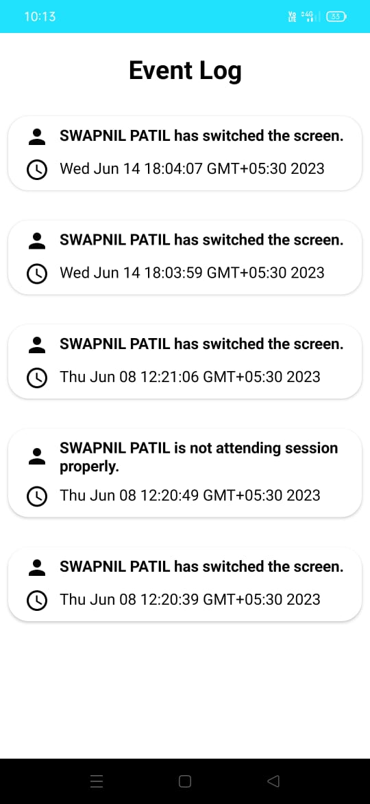

# Examiner
Examiner is an app which can detect whether a student is cheating in online exam or not. 
(Java, XML, Machine Learning, Firebase) 
APK Link: https://drive.google.com/file/d/1WBDnBKYuAidnGwtL25kkJglDxyePXLGd/view?usp=drive_link  

  
  
  

 

  
  
  

 

  
  
  

